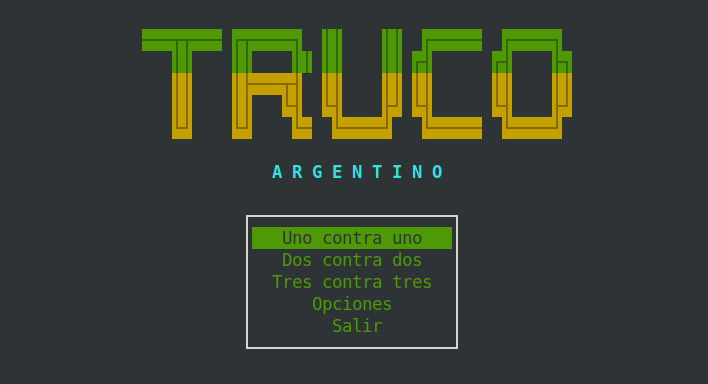
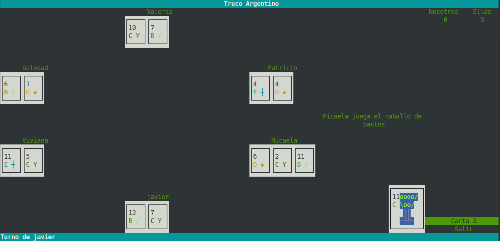
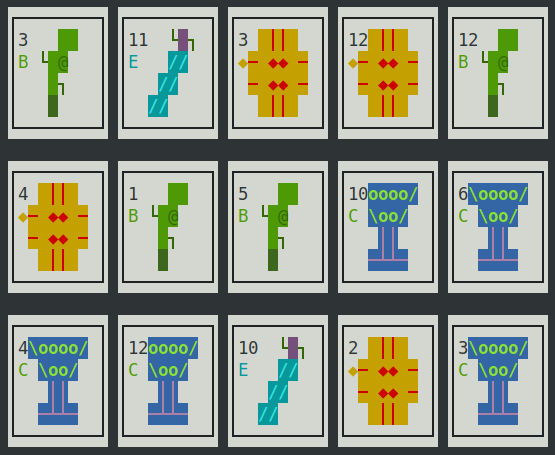
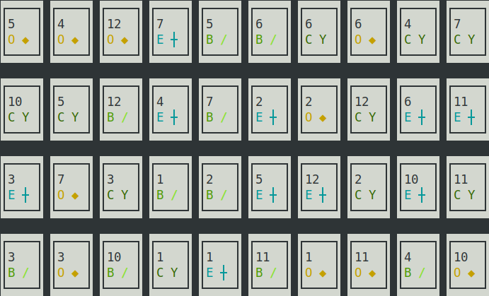

# Truco Argentino para terminal de Linux

---

<div align="center">
    <br>
Proyecto en construcción
</div>

---

Implementación del juego de cartas "Truco" en C++ moderno, diseñado para ejecutarse en la terminal de Linux. Utiliza *ncurses* como base y el módulo TCurses creado para éste juego.

Es de 2 a seis 6 jugadors (1 humano y el resto máquina).





---

### TCurses:
Submódulo creado específicamente para los "gráficos" Truco Argentino. Maneja texto mediante ncurses y se basa en una jerarquía de componentes tales como: Labels, Menu, Frames, Emergens, etc.

Contiene el motor base para correr el juego y la idea es envolver casi en su totalidad a ncurses.

Una de sus principales caracteristicas son las distribuciones automáticas de los componentes mediante BoxLayout.

---

### Gráficos:

Se utilizan *ascii art* para representar las cartas.





Las "imágenes" son generadas con [curses-art](https://github.com/codigoymate/curses-art). Curses-Art guarda los ascii art's en archivos binarios, pero también genera código c++ para insertar en los proyectos utilizando la siguiente paleta:
```c
/* Paleta de colores inicial de Truco Argentino */
unsigned p = 1;
for (unsigned bg = 0; bg < 8; bg ++) {
	for (unsigned fg = 0; fg < 8; fg ++) {
		init_pair(p, fg, bg); p ++;
	}
}
```

---

### Requerimientos:
* ncurses 5
* cmake >= 3.16.3

---

### Compilar y Ejecutar
```sh
$ mkdir build && cd build
$ cmake ..
$ make
$ ./truco/truco
```
